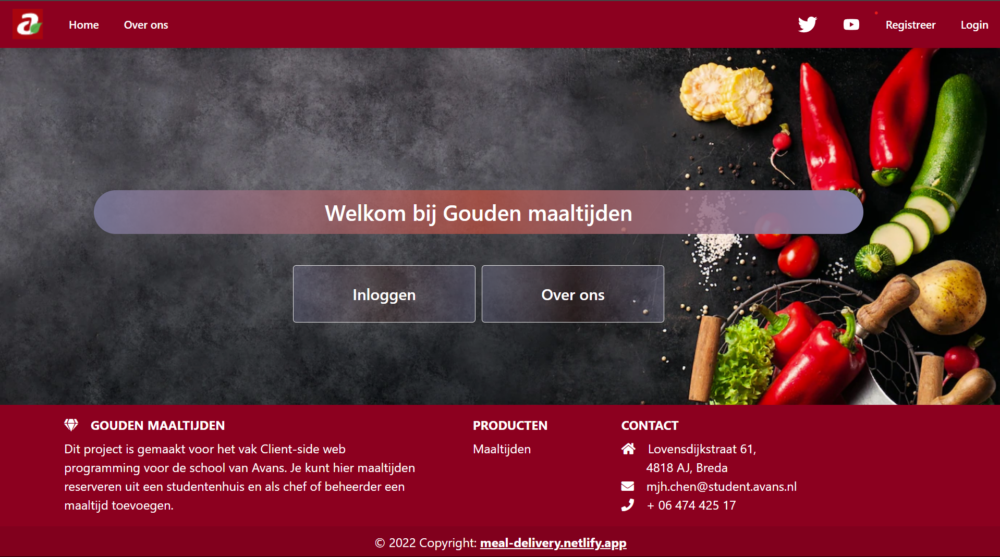

# MealDeliveryApp

Dit project is een client-side applicatie ontwikkeld in **TypeScript** met het **Angular** framework in een monorepo, gemaakt met behulp van **NX**. De backend is een **MongoDB** database die online is gehost. Dit resulteert in een full stack single page webapplicatie (SPA) met een NoSQL-database. Daarnaast wordt gebruik gemaakt van het **NestJS** framework.

Bekijk de applicatie hier: [Meal Delivery App](https://meal-delivery.netlify.app/).

Dit project is gegenereerd met [Angular CLI](https://github.com/angular/angular-cli) versie 13.3.9.

## Development server

Voer `ng serve` uit voor een ontwikkelserver. Navigeer naar `http://localhost:4200/`. De applicatie herlaadt automatisch als je wijzigingen aanbrengt in de bronbestanden.

## Code scaffolding

Voer `ng generate component component-name` uit om een nieuwe component te genereren. Je kunt ook `ng generate directive|pipe|service|class|guard|interface|enum|module` gebruiken.

## Build

Voer `ng build` uit om het project te bouwen. De build-artikelen worden opgeslagen in de `dist/` directory.

## Running unit tests

Voer `ng test` uit om de unit tests uit te voeren via [Karma](https://karma-runner.github.io).

## Running end-to-end tests

Voer `ng e2e` uit om de end-to-end tests uit te voeren via een platform naar keuze. Om deze opdracht te gebruiken, moet je eerst een pakket toevoegen dat end-to-end testmogelijkheden implementeert.

## Further help

Voor meer hulp met Angular CLI gebruik je `ng help` of bekijk de [Angular CLI Overview and Command Reference](https://angular.io/cli) pagina.
